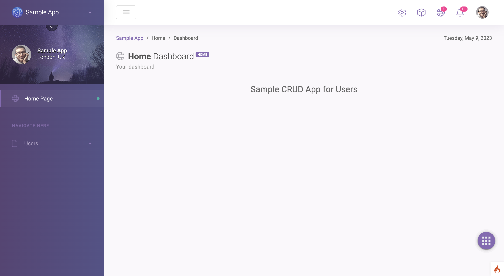
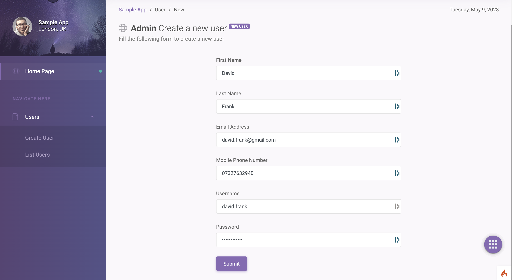
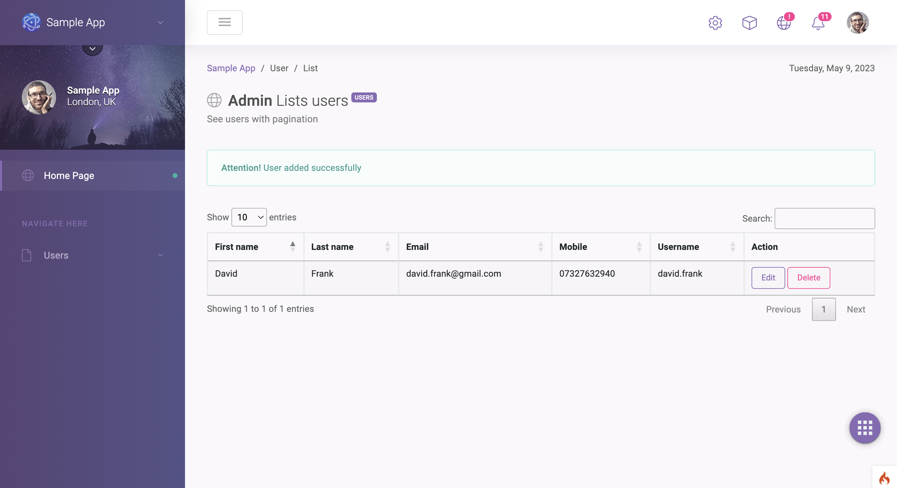
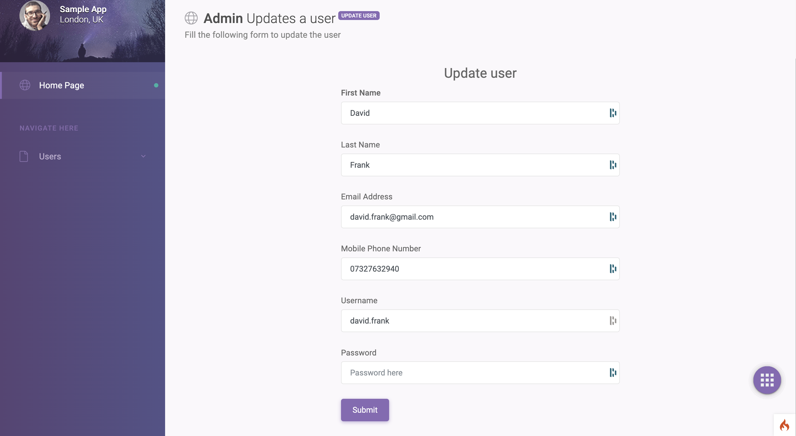
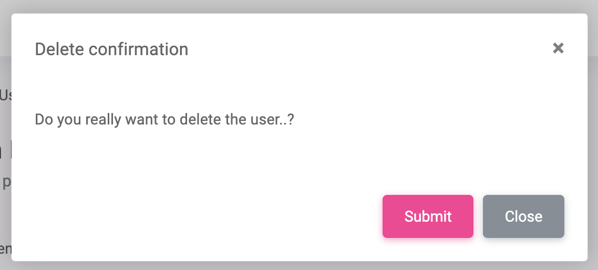
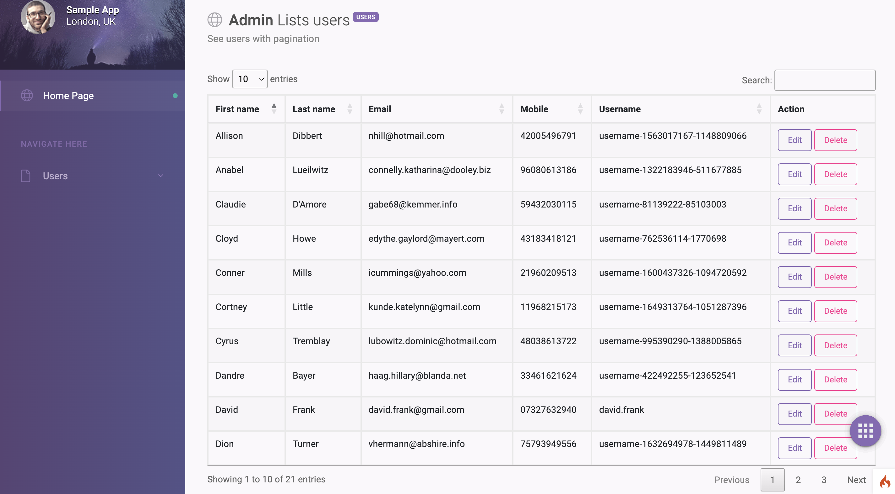
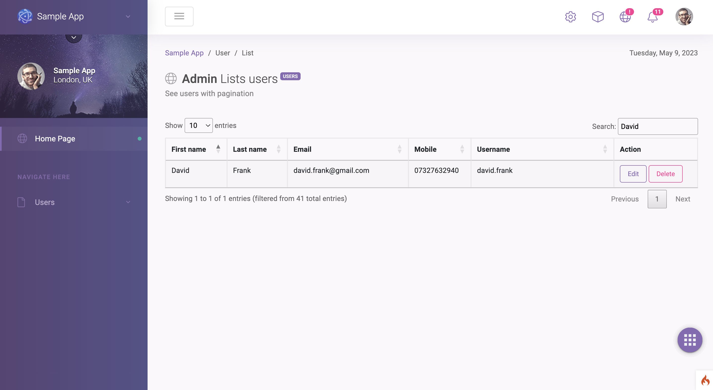

# Sample CRUD App using CodeIgniter

This is a sample app having CRUD operations on User object.

## Build the app

This app requires following softwares installed in your computer.
- [Composer](https://getcomposer.org/download/). Check whether `composer` command is available on your terminal.
```
composer -V
```
- [Docker desktop](https://www.docker.com/products/docker-desktop/)

- This app will use the ports 80, 3306 on your computer, hence they should be available and NOT being used by any of the computer's programs
- `git clone git@github.com:chamithlkml/simple-crud.git`
- `cd simple-crud`
- `composer install`
- `docker compose up -d`
- `docker exec -i app sh -c 'php spark migrate'`

## Running the unit tests
- `docker exec -i app sh -c './vendor/bin/phpunit'`

## View App
Navigate to http://localhost

### Home page


- Click Users >> Create User on the left navigation pane
- Fill the form and click on Submit button



- User will be redirected to the List users page with a success message.



- Click Edit button to view the Update user page



- Click Delete button to see the confirmation



- Click Submit to delete the user.

### Seed data for user
In order to see the pagination of the Datatable please execute the below command to seed some data

- `docker exec -i app sh -c 'php spark db:seed User'`

- Navigate to Users >> List Users



- Try navigating to other pages and Search. Search is enabled for First name, Last name, Email, Mobile and Username.



### Important
- This app uses Soft Delete option
- `username` field is unique
- `mobile` field must be 11 digits long